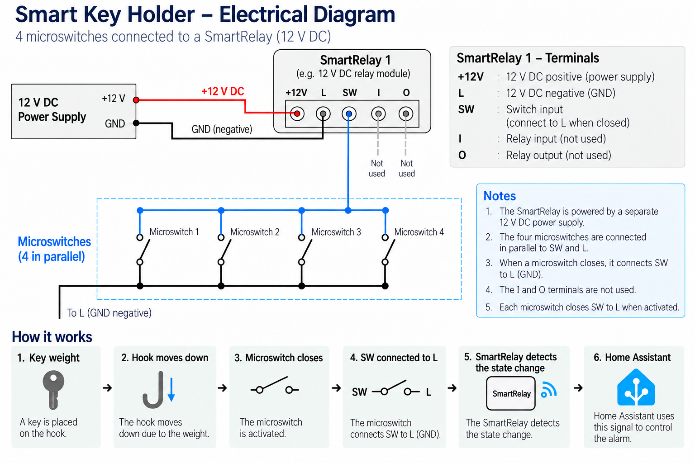

# 🔑 Smart Key Holder

### A physical interface for a smart home alarm system

> **Hang the key. Arm the alarm. Take the key. Disarm the alarm.**

## 💡 The Problem

This project started from a simple, real-world problem.

I already had a home alarm system integrated with Home Assistant, but not everyone in the house was comfortable interacting with a smart-home system.

I wanted a solution that was:

- **simple to use**
- **intuitive**
- **reliable**
- **completely physical**
- and still integrated with the existing smart-home infrastructure.

Instead of adding another app or touchscreen, I came up with a simple idea:

> **What if hanging up a key could become the interface for the alarm system?**

---

## 🛠️ The Solution

I designed a smart key holder containing four mechanical hooks, each connected to a microswitch.

When a key is placed on a hook, its weight moves the hook downward and activates the corresponding microswitch.

The microswitch then sends a signal to a smart relay, which communicates the state to Home Assistant.

The overall process is:

```text
Key
 ↓
Hook moves under the weight of the key
 ↓
Microswitch is activated
 ↓
Smart relay detects the contact
 ↓
Home Assistant
 ↓
Alarm state changes
```

The technology remains almost completely invisible to the user.

---

## ⚙️ Hardware Architecture

The key holder contains a removable internal drawer where the electronics and wiring are mounted.

Each hook mechanically activates a microswitch.

The four microswitches are connected in parallel to the relay input:

```text
                 ┌── Microswitch 1 ──┐
                 │                   │
SW ──────────────┼── Microswitch 2 ──┼──── L (GND)
                 │                   │
                 ├── Microswitch 3 ──┤
                 │                   │
                 └── Microswitch 4 ──┘
```

When any microswitch is activated, **SW is connected to L (GND)** and the relay detects the change of state.

### Electrical diagram



---

## 🔧 Mechanical Design

One of the interesting aspects of the project is that the input is not generated by an electronic sensor.

Instead, I use the **weight of the key itself as the mechanical trigger**.

Each hook can move vertically. When a key is placed on it, its weight pulls the hook down until it activates the microswitch.

This keeps the mechanism simple and uses inexpensive, readily available components.

The electronics are hidden inside a removable drawer, making the system easier to access for maintenance or modifications.

---

## 🏠 Home Assistant Integration

The smart relay provides the input state to **Home Assistant**, which can then use it as part of the alarm automation.

The key holder therefore acts as a **physical interface for the smart home**.

The architecture can be summarized as:

```text
Physical interface
       │
       ▼
Microswitches
       │
       ▼
Smart relay
       │
       ▼
Home Assistant
       │
       ▼
Alarm automation
```

The key holder itself does not need to know anything about the alarm logic. It simply provides an input state, while Home Assistant handles the higher-level automation.

---

## 🧠 Design Decisions

### Why microswitches?

Microswitches are inexpensive, mechanically simple and provide a clear binary state.

They also make the system easy to understand and troubleshoot.

### Why parallel connection?

The system only needs to know whether **at least one key is present**.

It does not need to identify which specific hook was activated, so connecting the microswitches in parallel keeps the electrical design simple.

### Why use a smart relay?

Rather than designing a complete wireless device from scratch, I used an existing smart relay as the bridge between the physical hardware and Home Assistant.

This reduces the amount of custom electronics required while keeping the project integrated with the existing smart-home infrastructure.

The prototype uses a SwitchBot relay, but the concept is not dependent on that specific brand. Any compatible smart relay with a suitable input could be used.

### Why a physical interface?

Because the most technologically advanced interface is not always the best interface.

For this use case, a physical action that everyone already understands is more effective than requiring users to interact with an app.

---

## 📐 Project Goals

| Goal | Design choice |
|---|---|
| Simple interaction | Hang or remove a key |
| Intuitive operation | Use an everyday physical action |
| Reliability | Mechanical microswitches |
| Easy integration | Smart relay + Home Assistant |
| Maintainability | Removable electronics drawer |
| Low complexity | Simple parallel wiring |

---

## 🔌 Components

- 12 V DC power supply
- Smart relay with a suitable switch input
- 4 × microswitches
- 4 × mechanical key hooks
- Key holder enclosure
- Wiring and connectors

---

## 🚧 Future Improvements

Possible future iterations could include:

- 3D-printed mechanical components
- status LEDs
- status audible alarm
- improved cable management
- more sophisticated Home Assistant automations
- a dedicated custom PCB

---

## 📚 What I Learned

This project required combining several areas:

- **mechanical design**
- **basic electronics**
- **digital inputs**
- **hardware integration**
- **home automation**
- **system design**
- **user-oriented design**

More importantly, it reinforced the importance of starting from the **problem and the user experience**, rather than from the technology itself.

The interesting part of the project is not just the key holder, but the way a simple physical action is transformed into an input for a larger software system.

---

## 📷 Gallery

Photos and additional documentation will be added here as the project evolves.

<!-- Add project photos here -->

---

## 📌 Project Status

**Work in progress.**

The current version is a functional prototype. Further iterations will focus mainly on improving the mechanical design, documentation and integration with Home Assistant.
