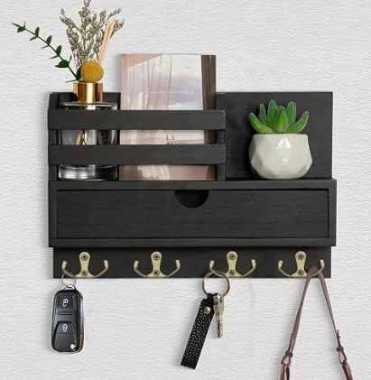
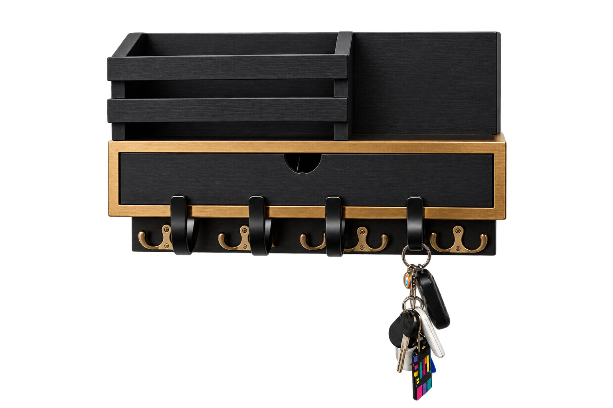
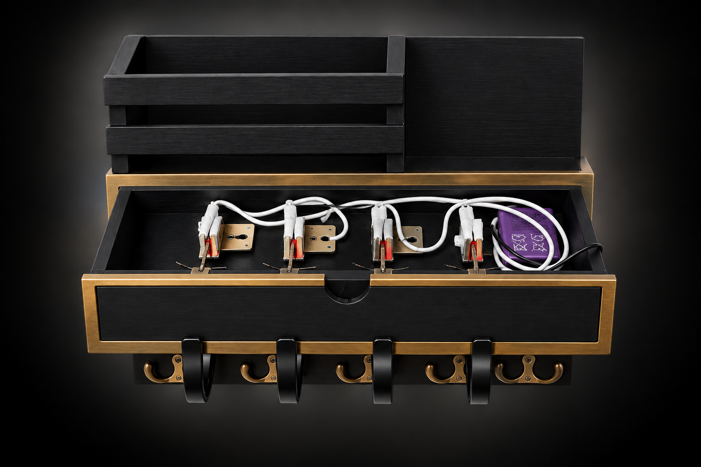
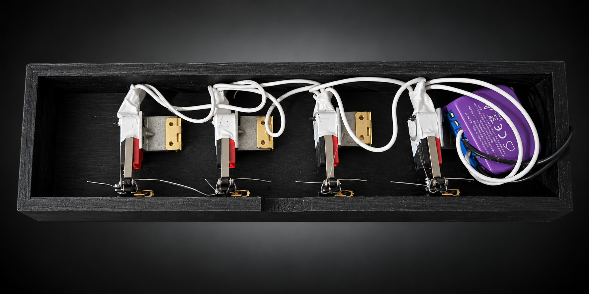

# 🔑 Smart Key Holder

### A physical interface for a smart home alarm system

> **Hang the key. Arm the alarm. Take the key. Disarm the alarm.**

---

## 💡 The Problem

This project started from a simple, real-world problem.

I already had a home alarm system integrated with Home Assistant, but not everyone in the house was comfortable interacting with a smart-home system.

I wanted a solution that was:

- **simple to use**
- **intuitive**
- **reliable**
- **completely physical**
- and still integrated with the existing smart-home infrastructure.

Instead of adding another app or touchscreen, I came up with a simple idea:

> **What if hanging up a key could become the interface for the alarm system?**

---

## 🛠️ The Solution

I started with a commercially available wall-mounted key holder with a drawer and four double hooks, and modified it to turn the mechanical movement of the hooks into electrical inputs.

Each hook is mechanically coupled to a microswitch.

When a key is placed on a hook, its weight moves the hook downward and activates the corresponding microswitch.

The microswitches then provide a signal to a smart relay, which communicates the input state to Home Assistant.

The overall process is:

```text
Key
 ↓
Hook moves under the weight of the key
 ↓
Microswitch is activated
 ↓
Smart relay detects the contact
 ↓
Home Assistant
 ↓
Alarm automation
```

The technology remains almost completely invisible to the user.

---

## 🧰 From Off-the-Shelf Product to Smart Device

Rather than designing the enclosure from scratch, I reused an existing consumer product and modified it internally.

The original key holder already provided:

- four double hooks
- a suitable mechanical structure
- a removable drawer
- enough internal space to install the electronics

The modification focuses on adding the sensing mechanism while preserving the original external appearance.

This makes the project a combination of **mechanical adaptation, basic electronics and home automation** rather than simply assembling a set of smart-home components.

---

## ⚙️ Hardware Architecture

The key holder contains a removable internal drawer where the electronics and wiring are mounted.

Each hook mechanically activates one microswitch.

The four microswitches are connected in parallel to the relay input:

```text
                    Microswitch 1
                         │
SW ──────────────────────┤
                         │
                    Microswitch 2
                         │
                         ├──────── L (GND)
                         │
                    Microswitch 3
                         │
                         │
                    Microswitch 4
                         │
                         │
```

More precisely, **SW is connected to the common side of the four microswitches**, while their other contacts are connected together and then routed to **L (GND)**.

When a microswitch closes, it connects **SW to L (GND)** and the relay detects the change of state.

> **Important:** SW and L are **not directly connected together**. The connection between them is made through the microswitch contacts.

### Power supply

The relay module is powered by a separate **12 V DC power supply**.

The microswitches are used as simple mechanical contacts in the relay input circuit.

### Electrical diagram


---

## 🔧 Mechanical Design

One of the interesting aspects of the project is that the input is not generated by an electronic sensor.

Instead, I use the **weight of the key itself as the mechanical trigger**.

Each hook can move vertically. When a key is placed on it, its weight pulls the hook down until it activates the microswitch.

This keeps the mechanism simple and uses inexpensive, readily available components.

The electronics are hidden inside a removable drawer, making the system easier to access for maintenance or modifications.

---

## 🏠 Home Assistant Integration

The smart relay provides the input state to **Home Assistant**, which can then use it as part of the alarm automation.

The key holder therefore acts as a **physical interface for the smart home**.

The architecture can be summarized as:

```text
Physical interface
       │
       ▼
Microswitches
       │
       ▼
Smart relay
       │
       ▼
Home Assistant
       │
       ▼
Alarm automation
```

The key holder itself does not need to know anything about the alarm logic. It simply provides an input state, while Home Assistant handles the higher-level automation.

---

## 🧠 Design Decisions

### Why microswitches?

Microswitches are inexpensive, mechanically simple and provide a clear binary state.

They also make the system easy to understand and troubleshoot.

### Why parallel connection?

The microswitches are connected in parallel so that the relay input can detect the contact state through a common circuit.

This keeps the electrical design simple and requires only a single input.

### Why use a smart relay?

Rather than designing a complete wireless device from scratch, I used an existing smart relay as the bridge between the physical hardware and Home Assistant.

This reduces the amount of custom electronics required while keeping the project integrated with the existing smart-home infrastructure.

The concept is not dependent on a specific relay brand: any compatible smart relay with a suitable input could be used.

### Why a physical interface?

Because the most technologically advanced interface is not always the best interface.

For this use case, a physical action that everyone already understands is more effective than requiring users to interact with an app.

---

## 📐 Project Goals

| Goal | Design choice |
|---|---|
| Simple interaction | Hang or remove a key |
| Intuitive operation | Use an everyday physical action |
| Reliability | Mechanical microswitches |
| Easy integration | Smart relay + Home Assistant |
| Maintainability | Removable electronics drawer |
| Low complexity | Simple parallel wiring |
| Preserve the original product | Internal modification only |

---

## 🔌 Components

- Commercial wall-mounted key holder with drawer
- 12 V DC power supply
- Smart relay with a suitable switch input
- 4 × SPDT roller-lever microswitches
- 4 × mechanical key hooks
- Wiring and connectors

The project deliberately avoids being tied to specific component brands where the brand is not relevant to the design.

---

## 📷 Project Gallery

### Original product

The project started from a commercially available key holder before modification.



### Finished device



### Internal electronics



### Microswitch assembly



---

## 📁 Project Structure

```text
smart-key-holder/
│
├── README.md
│
├── images/
│   ├── original-key-holder.jpg
│   ├── 01_installed_final.png
│   ├── 02_internal_wiring.png
│   ├── 03_internal_wiring_detail.png
│
└── docs/
    └── electrical-diagram.png
```

---

## 🚧 Future Improvements

Possible future iterations could include:

- 3D-printed mechanical components
- individual key detection
- status LEDs
- status audible alarm
- improved cable management
- a custom enclosure designed specifically for the mechanism

---

## 📚 What I Learned

This project required combining several areas:

- **mechanical design**
- **basic electronics**
- **digital inputs**
- **hardware integration**
- **home automation**
- **system design**
- **user-oriented design**

More importantly, it reinforced the importance of starting from the **problem and the user experience**, rather than from the technology itself.

The interesting part of the project is not just the key holder, but the way a simple physical action is transformed into an input for a larger software system.

---

## 📌 Project Status

**Functional prototype.**

The current version combines the modified mechanical key holder, four microswitches, the relay interface and Home Assistant.

Further iterations will focus mainly on improving the mechanical design, documentation and automation logic.
